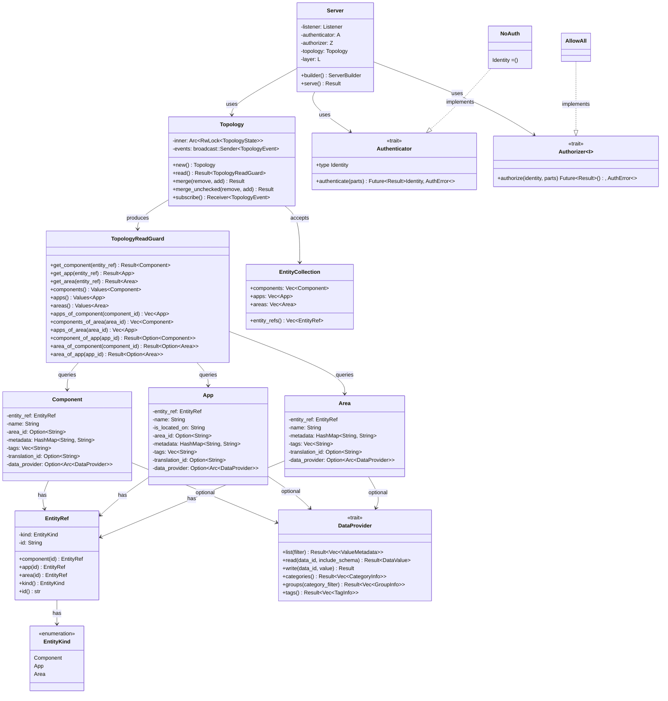
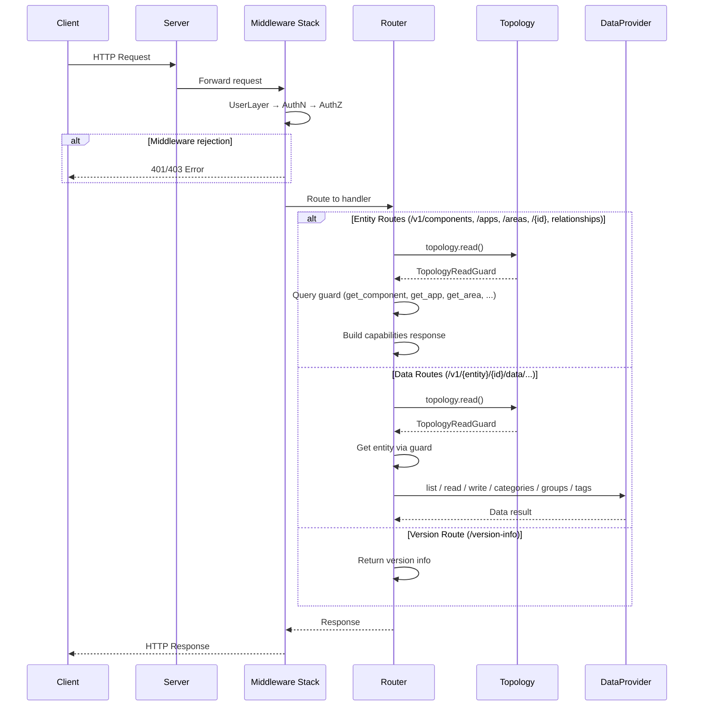

# Architecture

## Class Diagram

## Main Components

### Server

The main entry point for the OpenSOVD application. Built using a builder pattern that allows configuring authentication, authorization, topology, and custom Tower layers. Supports both TCP and Unix socket listeners. On `serve()`, it starts the Axum HTTP server with graceful shutdown.

**Crate:** `opensovd-server`

### Topology

A thread-safe registry for components, apps, and areas. Wraps an `Arc<RwLock<TopologyState>>` where the state holds three `IndexMap` collections (one per entity kind) plus relationship indexes (`apps_by_component`, `components_by_area`, `apps_by_area`). Reading is done through `read()` which returns a `TopologyReadGuard` holding a single read lock for consistent multi-query access. Mutations use `merge()` (validates no duplicates or missing removals) or `merge_unchecked()` (silently skips missing removals, overwrites duplicates). Both emit `TopologyEvent::Added` / `TopologyEvent::Removed` via a `broadcast` channel. Callers can `subscribe()` to receive these events.

**Crate:** `opensovd-core`

### TopologyReadGuard

A read guard over the topology state. Holds a `RwLockReadGuard` for its lifetime, ensuring a consistent snapshot across multiple queries. Provides `get_component()`, `get_app()`, `get_area()` for single-entity lookup, `components()`, `apps()`, `areas()` for listing, and relationship queries: `apps_of_component()`, `components_of_area()`, `apps_of_area()`, `component_of_app()`, `area_of_component()`, `area_of_app()`.

**Crate:** `opensovd-core`

### EntityRef / EntityKind

`EntityKind` is an enum with variants `Component`, `App`, and `Area`. `EntityRef` is a lightweight reference containing a `kind` and `id`. Factory methods `EntityRef::component()`, `EntityRef::app()`, and `EntityRef::area()` create refs. All entity structs hold an `EntityRef` and expose it via `entity_ref()`. `EntityCollection` groups `Vec<Component>`, `Vec<App>`, and `Vec<Area>` for batch topology operations.

**Crate:** `opensovd-core`

### Component

A SOVD component entity. Fields: `entity_ref`, `name`, `area_id` (optional link to an area), `metadata` (key-value pairs), `tags`, `translation_id`, and an optional `Arc<dyn DataProvider>`. Constructed via `Component::new(id, name)` with builder methods (`with_area_id`, `with_tags`, `with_metadata`, `with_data_provider`, etc.).

**Crate:** `opensovd-core`

### App

A SOVD app entity representing software running on a component. Fields: `entity_ref`, `name`, `is_located_on` (component ID, the "is-located-on" relationship), `area_id` (optional), `metadata`, `tags`, `translation_id`, and an optional `Arc<dyn DataProvider>`. Constructed via `App::new(id, name, is_located_on)` with builder methods.

**Crate:** `opensovd-core`

### Area

A SOVD area entity representing a logical view of vehicle architecture (e.g., domain or zone). Fields: `entity_ref`, `name`, `metadata`, `tags`, `translation_id`, and an optional `Arc<dyn DataProvider>`. Constructed via `Area::new(id, name)` with builder methods.

**Crate:** `opensovd-core`

### DataProvider (trait)

A pluggable data backend. Each entity holds its own provider instance, so methods operate on the provider directly without an entity reference:

- `list(filter: DataFilter) → Vec<ValueMetadata>` — list data items, filtered by categories/groups/tags
- `read(data_id, include_schema) → DataValue` — read a single data value
- `write(data_id, value) → ()` — write a data value

Default implementations derive from `list()`:

- `categories() → Vec<CategoryInfo>` — unique categories
- `groups(category_filter) → Vec<GroupInfo>` — groups optionally filtered by category
- `tags() → Vec<TagInfo>` — unique tags

**Crate:** `opensovd-core`

### Authenticator (trait)

Extracts and validates credentials from incoming requests. Has an associated type `Identity` representing the authenticated principal. Returns `Ok(Identity)` on success or `Err(AuthError::Unauthenticated)` on failure. `NoAuth` is the no-op implementation (Identity = `()`). Blanket impl for `Option<A>` returns `Option<A::Identity>`, allowing optional authentication.

**Crate:** `opensovd-server`

### Authorizer (trait)

Determines whether an authenticated identity has permission for a request. Generic over the identity type `I`. Takes `(identity, request_parts)` and returns `Ok(())` or `Err(AuthError::Unauthorized)`. Implementation: `AllowAll` permits all requests.

**Crate:** `opensovd-server`

## Request Lifecycle

The following diagram shows how an HTTP request flows through the server: from the middleware stack (authentication and authorization) to the router, which dispatches to entity, data, or version handlers.

### Middleware Stack

Every request passes through the middleware stack in this order:

1. **User layers** (CORS, tracing, etc.) — applied outermost via the configurable `Layer` generic.
2. **`AuthenticationLayer`** — calls `Authenticator::authenticate()` to extract an identity from the request. On success, the identity is stored in request extensions. On failure, the request is rejected immediately with **401 (empty body)**.
3. **`AuthorizationLayer`** — retrieves the identity from request extensions (set by AuthN) and calls `Authorizer::authorize()`. On failure, the request is rejected with **403** and a JSON `GenericError` body containing the `insufficient-access-rights` error code.

If both layers pass, the request is forwarded to the matched route handler.

### Entity Routes

`GET /{entity-collection}` (e.g., `/components`, `/apps`, `/areas`) acquires a read lock via `topology.read()` → `TopologyReadGuard`, iterates/filters the matching entities, and returns a JSON array of `EntityReference` objects. `GET /{entity-collection}/{id}` looks up a single entity and returns its capabilities, including relationship hrefs and data provider availability. Returns **404** if the entity is not found.

### Data Routes

`GET /{entity}/{id}/data/{data_id}` acquires a read lock, fetches the entity from the `TopologyReadGuard`, extracts its `DataProvider`, and calls `read()`. `PUT` follows the same lookup but calls `write()` instead. Returns **404** if the entity or data item is not found, **400** if a write is attempted on a read-only item, and **204 No Content** on a successful write.

### Version Route

`GET /version-info` returns the SOVD specification version, base URI, and optional vendor-specific information. This route does not access the topology.
