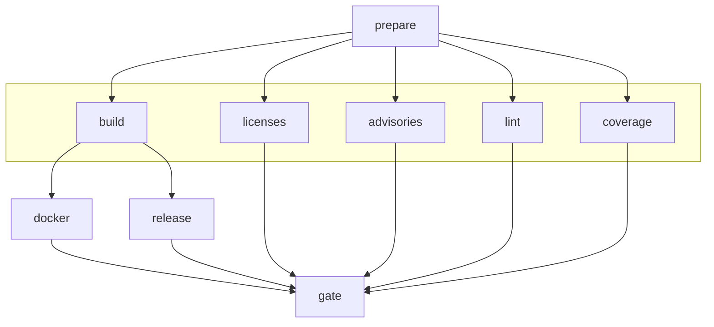

# CI/CD Pipeline

This document describes the GitHub Actions CI/CD pipeline for opensovd.

## Jobs

| Job            | Runs On                | Description                                                                           |
|----------------|------------------------|---------------------------------------------------------------------------------------|
| **prepare**    | Always                 | Entry point; determines release type and whether to run (skips nightly if no changes) |
| **build**      | When `should_run=true` | Builds for Linux, Windows, macOS; runs tests and pytest                               |
| **licenses**   | When `should_run=true` | Checks licenses and sources with cargo-deny                                           |
| **advisories** | When `should_run=true` | Checks security advisories; uploads SARIF on main/nightly                             |
| **lint**       | When `should_run=true` | Runs rustfmt, clippy, and pre-commit hooks (prek)                                     |
| **coverage**   | When `should_run=true` | Generates coverage report, deploys to GitHub Pages on main                            |
| **docker**     | main/tags/schedule     | Builds and pushes Docker images (gateway, mcp) to GHCR                                |
| **release**    | main/tags/schedule     | Creates GitHub release with artifacts and changelog                                   |
| **gate**       | Always                 | Final check that all jobs passed (use for branch protection)                          |

## Dependency Chain

Jobs `build`, `licenses`, `advisories`, `lint`, and `coverage` run in parallel after `prepare`.

## Nightly Skip Logic

The `prepare` job compares the current SHA with the `nightly` tag. If unchanged, it sets `should_run=false` and all downstream jobs are skipped, saving CI resources.

## Release Tags

| Tag       | Trigger            | Description                                     |
|-----------|--------------------|-------------------------------------------------|
| `latest`  | Push to main       | Latest successful main branch build             |
| `nightly` | Daily at 02:00 UTC | Scheduled nightly build (skipped if no changes) |
| `vX.Y.Z`  | Tag push           | Versioned production release                    |

## Docker Tags

| Tag                  | When Created        | Description                            |
|----------------------|---------------------|----------------------------------------|
| `latest`             | main or version tag | Points to the most recent stable build |
| `nightly`            | Scheduled build     | Latest nightly build                   |
| `nightly-YYYY-MM-DD` | Scheduled build     | Date-stamped nightly build             |
| `vX.Y.Z`             | Version tag push    | Specific version release               |

## Branch Protection

Use the `gate` job as the required status check for branch protection rules.
